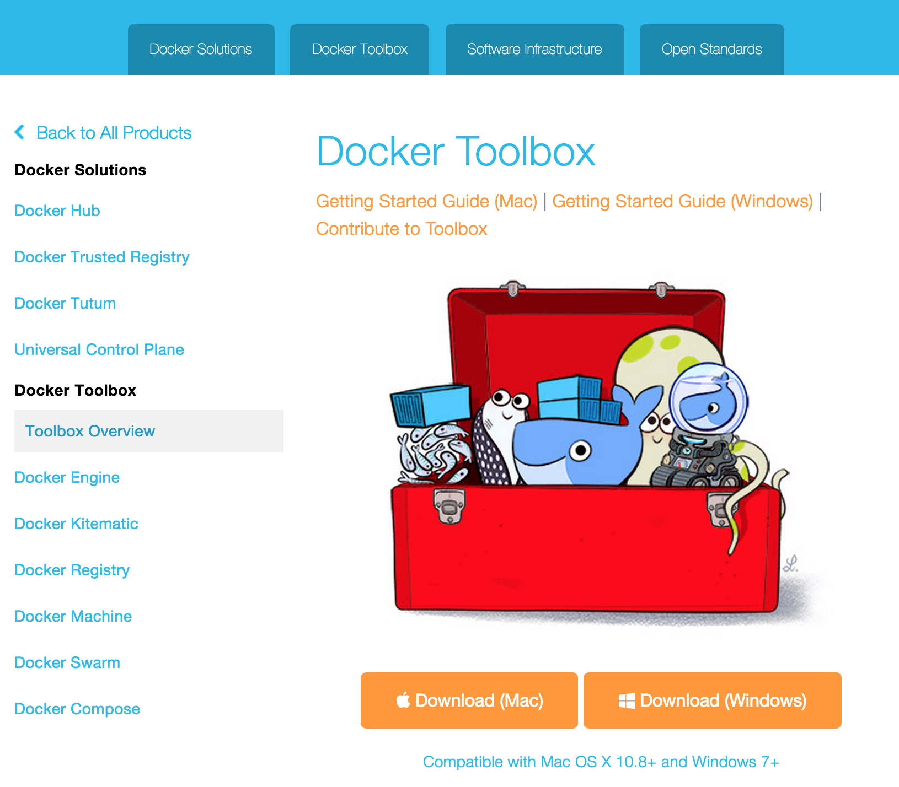
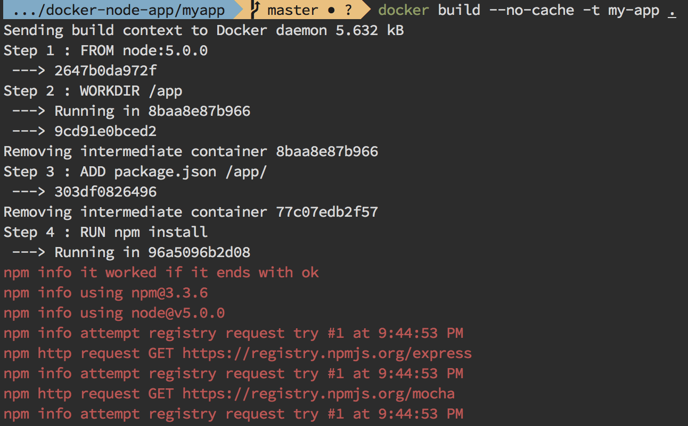
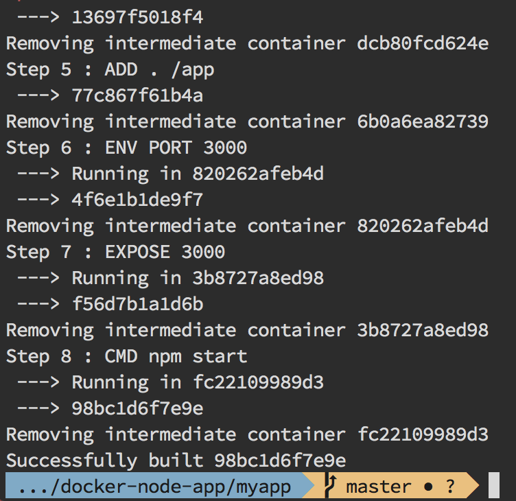
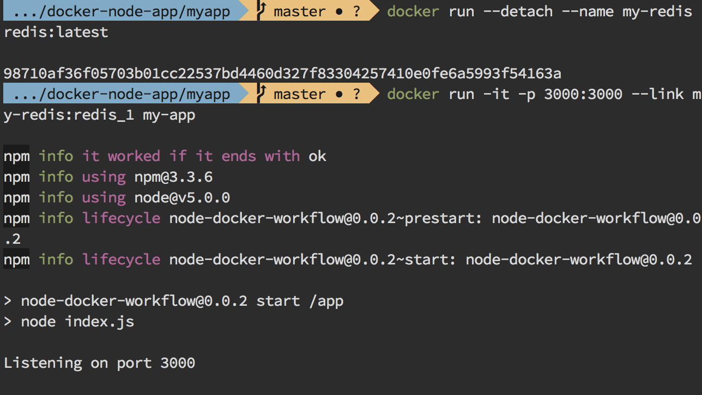

name: dockerizando-nodejs
class: center, middle, inverse

# Dockerizando uma aplicação NodeJS

### Nice subtitle

---

## Sobre mim

TODO: coloca foto!

- Consultor desenvolvedor na ThoughtWoks
- Conhece Docker a 2 anos

TODO: foto?

---

Use aciinema rec

[](https://asciinema.org/a/1ktdq2d1rt9mmy7akisaeswsu)

---

## Agenda

- O que é, por que e como instalar Docker?
- A aplicação node
- Dockerfile
- Build & run
- `docker-compose`

---

## O que é por que Docker?

- Isolamento: cgroups e namespaces
- Empacotamento de dependências: imagens imutáveis
- Deploys atômicos
- Um app por container, vários containers no mesmo Docker host compartilhando um kernel

---


## Instalação

OSX:

```sh
brew install docker docker-compose docker-machine
```

Ou Docker Toolbox: https://www.docker.com/docker-toolbox

.fixsize.center[  ]

---

## A aplicação

- Um simples contador de visitas em NodeJS + Express
- Persistência em Redis
- https://github.com/labianchin/docker-nodejs-demo

.smaller[
```javascript
var express = require('express'),
    http = require('http'),
    redis = require('redis');

var client = redis.createClient(
  process.env.REDIS_1_PORT_6379_TCP_PORT || 6379,
  process.env.REDIS_1_PORT_6379_TCP_ADDR || '127.0.0.1'
);

var app = express();
app.get('/', function(req, res, next) {
  client.incr('visits', function(err, visits) {
    if(err) return next(err);
    res.send('Esta página foi visitada ' + visits + ' vezes!');
  });
});

http.createServer(app).listen(process.env.PORT || 3000, function() {
  console.log('Listening on port ' + (process.env.PORT || 3000));
});
```
]

---

## Criando um Dockerfile

```Dockerfile
FROM node:5.0.0

WORKDIR /app

ADD . /app
RUN npm install

ENV PORT=3000
EXPOSE 3000

CMD npm start
```

- Cada comando cria uma layer/camada
- Essas camadas são hierárquicas e cacheáveis

.hidden[
https://github.com/nodejs/docker-node/blob/2445743c1453941f787b0aa22cca51c62a1a3f09/5.0/Dockerfile
]

---

## Build

```sh
docker build -t my-app .
```

.fixsize[


]

TODO: side by side... and rec-build.json

---

## Run

- Rodar redis linkado ao app

```sh
docker run --detach --name my-redis redis:latest
docker run -it -p 3000:3000 --link my-redis:redis_1 my-app
```

.fixsize.center[

]

---

## Com cache


```Dockerfile
FROM node:5.0.0

WORKDIR /app

ADD package.json /app/
RUN npm install

ADD . /app

ENV PORT=3000
EXPOSE 3000

CMD npm start
```

---

## docker-compose

Cansado de vários `docker run`?

```docker-compose.yml
web:
  build: .
  ports:
    - "3000:3000"
  links:
   - redis
redis:
  image: redis:latest
```

```
docker-compose up
```

---

## Criando um build automatizado no Docker hub

TODO: ...

---

## Outros detalhes

- CI: build, test and package
- Em produção: entenda sobre mesos e/ou kubernetes

---

## Algumas fontes e links

- http://mherman.org/blog/2015/03/06/node-with-docker-continuous-integration-and-delivery/
- https://www.airpair.com/node.js/posts/getting-started-with-docker-for-the-nodejs-dev
- http://anandmanisankar.com/posts/docker-container-nginx-node-redis-example/

---

class: center, middle, inverse

## Perguntas?

